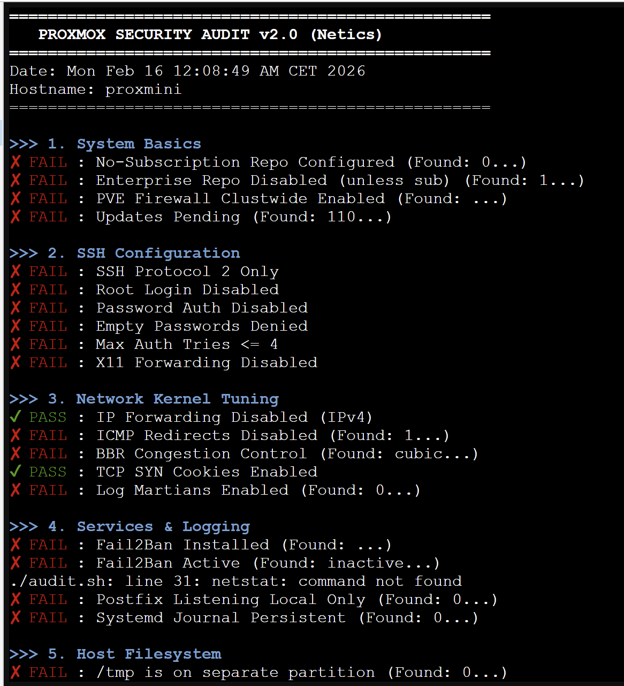
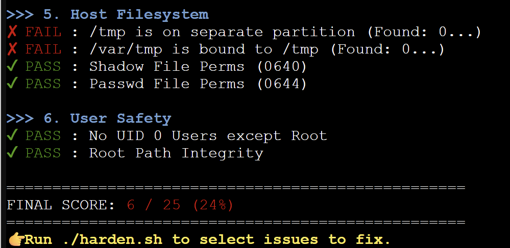

# Proxmox Hardening Suite v2.0 🛡️

<div align="center">


**Banking-Grade Security for Your Homelab**

Audit and Harden your Proxmox VE node in minutes.
Based on enterprise standards (CIS Benchmarks) and real-world production setups.




[Report Bug](https://github.com/tahaex/proxmox-hardening-suite/issues) · [Request Feature](https://github.com/tahaex/proxmox-hardening-suite/issues)

</div>

---

## 🚨 Why Secure Proxmox?
A default Proxmox installation is designed for usability, not security.
*   Root SSH is often enabled.
*   Fail2Ban is missing (brute-force attacks are easy).
*   Kernel network stack is unoptimized (IPv6 enabled, ICMP redirects open).
*   Enterprise repositories throw unrelated errors.

**`proxmox-hardening-suite`** fixes this.

## 🛠️ The Scripts

### 1. `audit.sh` (Read-Only)
Running **30+ Security Checks** covering:
*   [x] **System**: Updates, Enterprise Repos, Firewall status.
*   [x] **SSH**: Root Login, Password Auth, MaxAuthTries, Protocol 2.
*   [x] **Network**: IP Forwarding, BBR, ICMP Redirects, Martians.
*   [x] **Services**: Fail2Ban, Postfix (Localhost only), Journal persistence.
*   [x] **Users/Files**: Shadow permissions, UID 0 checks, /tmp partition.

**Usage:**
```bash
wget https://raw.githubusercontent.com/tahaex/proxmox-hardening-suite/main/audit.sh
bash audit.sh
```

### 2. `harden.sh` (Interactive Fixer)
Applies fixes step-by-step. You choose what to apply.
*   **Repo Fix**: Switches from Enterprise to No-Subscription repos.
*   **Fail2Ban**: Installs and configures jails for Proxmox GUI (8006) and SSH (22).
*   **SSH Hardening**: Disables Root Login and Password Authentication (Keys only).
*   **Kernel Tuning**: Enables BBR congestion control and IP Spoofing protection.
*   **IPv6**: Disables IPv6 stack (optional).

**Usage:**
```bash
wget https://raw.githubusercontent.com/tahaex/proxmox-hardening-suite/main/harden.sh
chmod +x harden.sh
./harden.sh
```

---

## ⚠️ Critical Warning
**Do NOT disable Password Authentication or Root Login if you haven't added your SSH Key first.**
You will lock yourself out.
Always keep a backup access method (IPMI, Physical Console, or a second user).

---

## License
MIT License.
Built by **[Netics](https://netics.fr)**.
